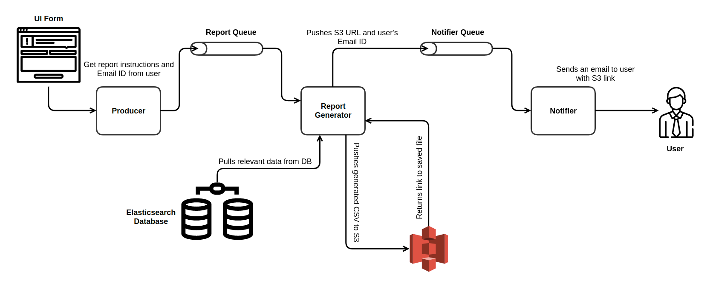

# Report Generator

A Report Generator service that creates CSV report from sample flight log data based on user query, uploads to S3 and sends it to the user by email.

## Architecture



## Technologies Used

- Golang

- Elasticsearch

- Docker

- AWS S3

- Beanstalk

- Send Grid

## Services

- **Producer** - Gets Report Query and User Contact Information from the user

- **Report Generator** - Queries ES database based on user query and creates a CSV file of the data and uploads to S3 bucket

- **Notifier** - Send the S3 link of the uploaded CSV file to the user by email

## Setup Process

1. Create a `.env` file in the root directory of the repo and fill the credentials in the `.env.example`. You will need a Send Grid account and AWS account. Create a S3 bucket with public read policy.

   ```json
   {
     "Version": "2012-10-17",
     "Statement": [
       {
         "Sid": "PublicReadGetObject",
         "Effect": "Allow",
         "Principal": "*",
         "Action": "s3:GetObject",
         "Resource": "arn:aws:s3:::dev-report-generator/Reports/*"
       }
     ]
   }
   ```

2. Run `docker-compose up` in the root of the repo.

3. Before using you have to insert the data into the ES data base. CD into `./DB` and run `import.py` to insert the data into the database.

4. Go to `localhost:8080` to use the app.

### To run with Docker Swarm

```bash
  docker swarm init
  docker-compose build
  docker stack deploy -c ./docker-compose.yml report
```

**To tear down the stack:**

```bash
  docker stack rm talk
```
